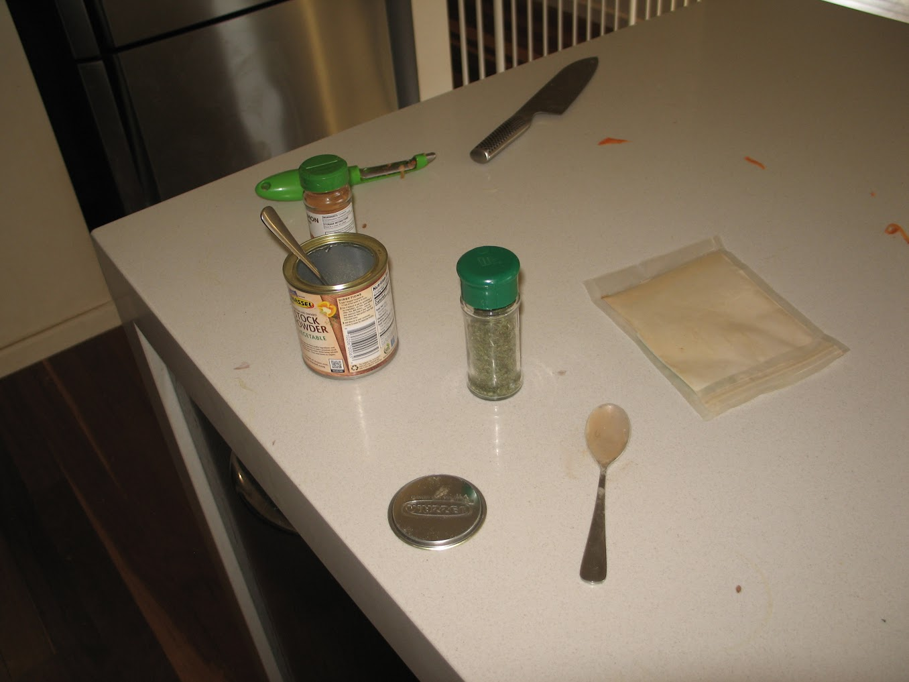

the first recipe post on **xxiwriterecipesnotlovelettersxx**. you know it and you love it

### Ingredients
- olive oil
- 1 onion diced
- 3 cloves garlic
- 2tsp crushed ginger
- 1tsp dried mint
- 1tsp ground cardamom
- 1tsp cinnamon
- 1/3 large pumpkin
- 1/2 large sweet potato
- 2 carrots
- 4 cups veg. stock
- 400g can chickpeas
- 400g can tomatoes
- group black pepper
- fresh mint leaves (if you're feeling crazy)

### Instructions
1. in a large pot with oil (medium heat), cook onion, garlic, ginger, until onion becomes transparent.
2. add spices and stir through.
3. add large pieces of pumpkin, sweet potato, and carrots to sit in the pot. pour in vegetable stock.
4. drain then add chickpeas, then tomato, ensuring the soup is stirred.
5. cover, bring to a boil, and reduce to simmer for 45 minutes.
6. blend roughly with a stick blender, making sure no whole pieces of pumpkin, sweet potato, and carrot remain.
7. if you are feeling crazy top it with FRESH not dry mint leaves. this soup is soooooo good with seedy sourdough bread & vegan butter !

> serve it forth <3

